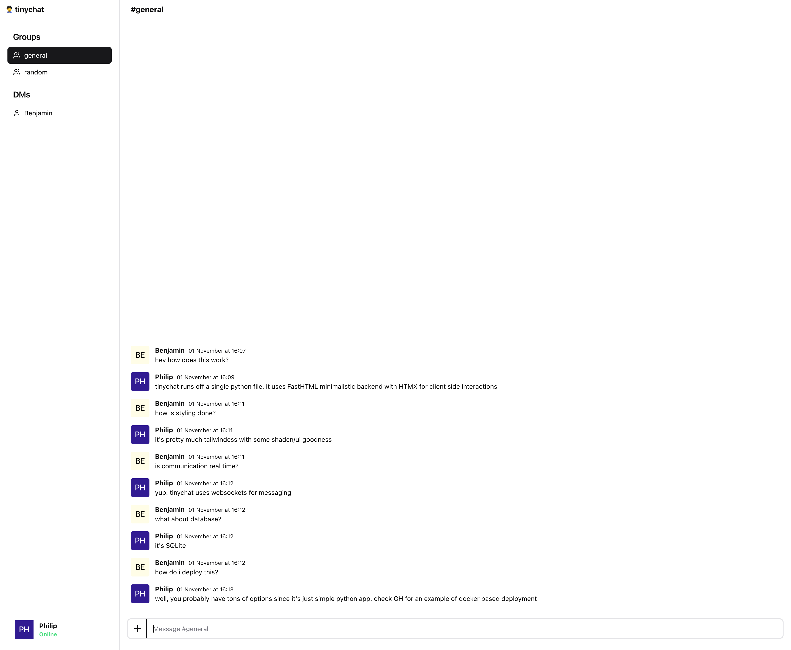

<h1 align="center">tinychat</h1>
<p align="center">Chat so small it fits in 1 python file</p>

> 🚧 This project is in active development. Things might be broken and will likely change.



# Hacking on the app locally

Make sure you have Poetry [installed](https://python-poetry.org/docs/#installation)

```
LIVE_RELOAD=yes poetry run python app.py
```

# Running tests locally

If running tests for the first time, install drivers for playwright

```
poetry run playwright install
```

Run tests

```
TEST_MODE=yes poetry run pytest app.py --base-url http://localhost:5002
```

Run tests with debugger

```
TEST_MODE=yes PWDEBUG=1 poetry run pytest app.py --base-url http://localhost:5002 -s
```

# Deploy

Check [deploy](https://github.com/callmephilip/tinychat/tree/deploy) branch for an example deployment approach.

